# FixMyCity — User Manual

CSCD 602 Capstone — Group Zero Down Time. Covers all four roles: Citizen, Reports
Officer, Field Crew, Administrator. Screens referenced below are real, live captures
from `docs/design/screenshots/` (see `docs/design/UI_SCREENSHOTS.md` for the full
set) — nothing in this manual describes a mockup.

## Getting started

There are two separate applications:

- **Citizen app** (mobile-first): https://fixmycity-citizen.vercel.app — for
  residents reporting issues.
- **Operations console** (desktop): https://fixmycity-console.vercel.app — for AWMA
  staff (Reports Officers, Field Crew, Administrators).

Both use real email/password sign-in. Test credentials are provided with the
capstone submission package (`Links.txt`), not published in this document since it
lives in a public repository.

---

## 1. Citizen Guide

### 1.1 Signing in

Open the citizen app and sign in with your email and password.

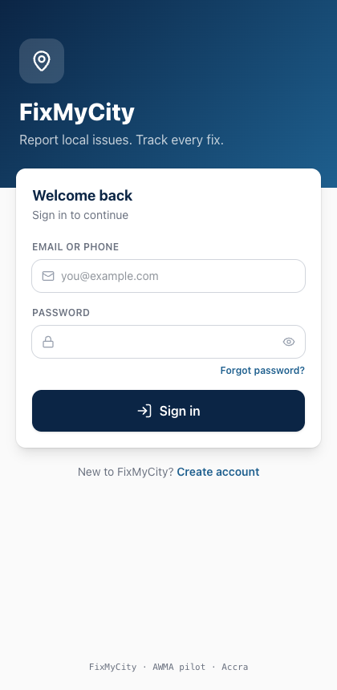

New residents create an account with an email or Ghanaian phone number; a
verification email must be confirmed before you can submit a report.

### 1.2 Home screen

After signing in you land on Home: a prominent "Report an issue" button, your total
and in-progress report counts, and your most recent reports.

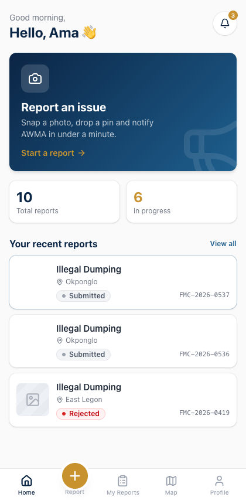

### 1.3 Reporting an issue

Tap **Report** in the bottom navigation. The flow has three steps:

**Step 1 — Category.** Pick one of the nine categories: Illegal Dumping, Blocked
Drain, Broken Streetlight, Flooding, Pothole, Pollution, Broken Public Facility, Poor
Sanitation, or Other.

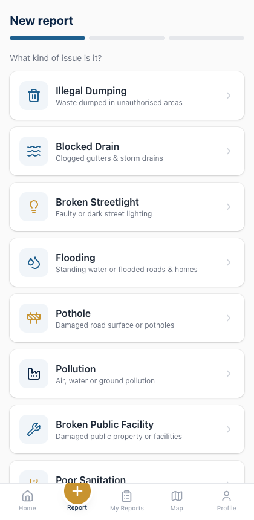

**Step 2 — Photo, location, description.** Take or choose a photo (required — you
cannot submit without one), confirm or adjust your location on the map, and
optionally add a description.

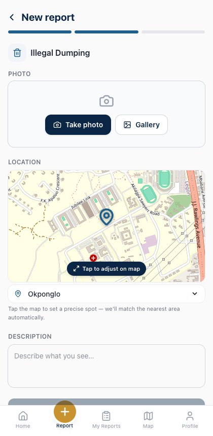

**Step 3 — Confirmation.** On submit, your photo is analysed automatically:

- If it's outside the Ayawaso West municipality, submission is blocked with a clear
  message — the pilot only covers this one municipality.
- If the photo doesn't look like a genuine environmental issue (for most
  categories), you'll be asked to retake it.
- If it looks like the **same issue someone else already reported**, you won't get a
  duplicate — you'll be offered the option to **follow their report instead**, so you
  still get every status update, or to submit anyway if it's genuinely a different
  issue.
- If it's the same issue you've already reported yourself, you'll see an
  "already reported" message pointing you to your existing report.
- Otherwise, you get a confirmation screen with a reference number
  (`FMC-2026-NNNN`) and a "Submitted" status.

### 1.4 Tracking your reports

**My Reports** lists everything you've submitted or follow, newest first.

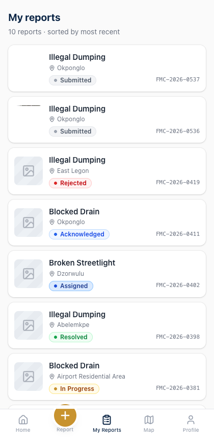

Tap any report to see its full detail, including a **status timeline** — every
transition your report has been through, with a timestamp and who made it.

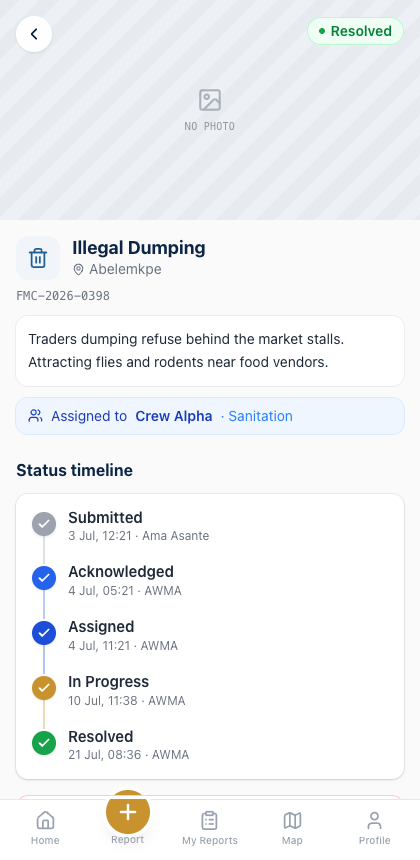

- If your report reaches **Resolved** and the problem genuinely isn't fixed, you can
  **Reopen** it within 7 days of resolution.
- If your report is still **Submitted** (not yet acknowledged), you can **Cancel**
  it if you filed it by mistake.
- If you're following someone else's report, you can **Unfollow** at any time.

### 1.5 Map

The Map screen shows every open report across Ayawaso West, colour-coded by status,
without revealing who reported it.

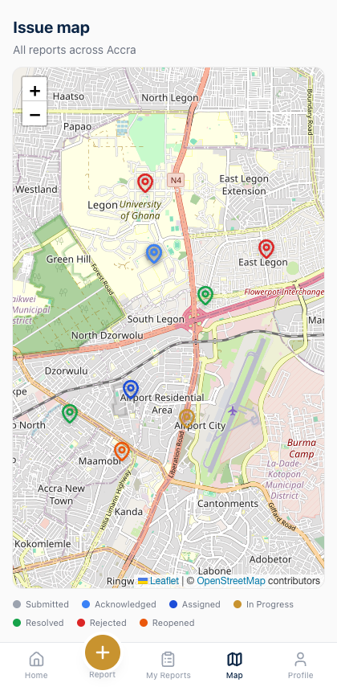

### 1.6 Profile

Manage your name, contact details, and notification preferences from Profile.

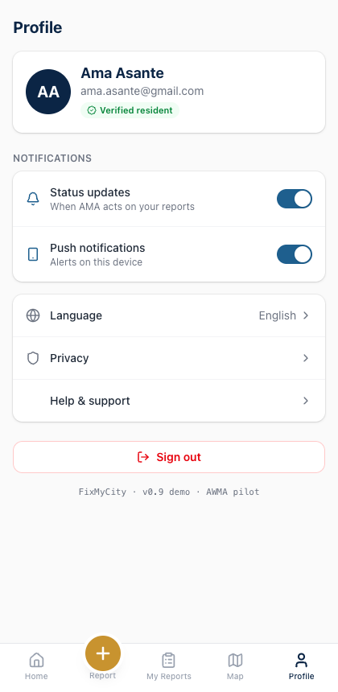

---

## 2. Reports Officer Guide

Reports Officers work from the operations console. Sign in with your AWMA staff
account.

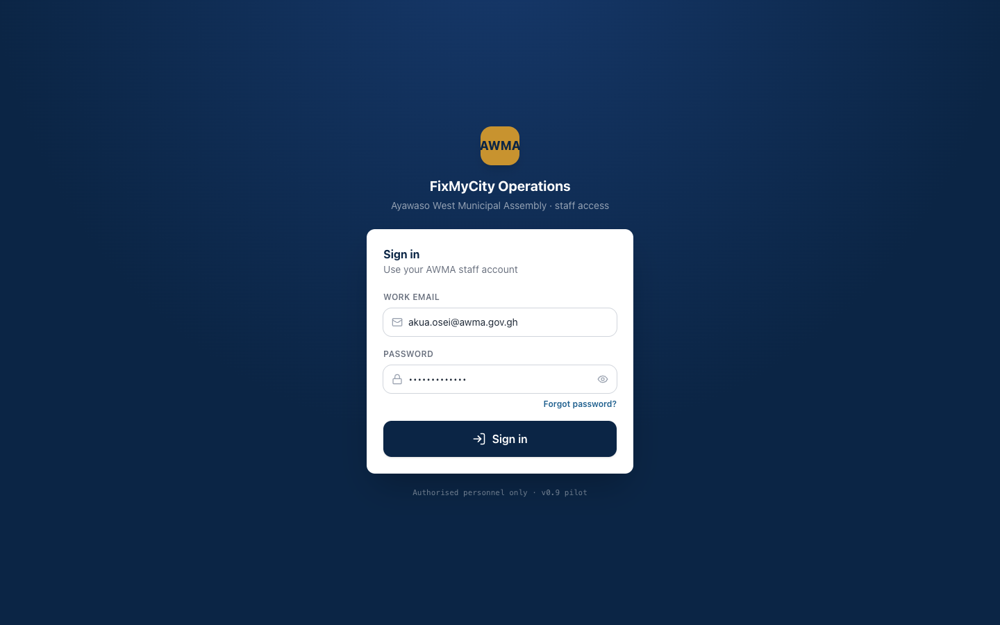

### 2.1 The Inbox

The Inbox is your default landing screen: filter chips with live counts for every
status, dropdown filters for category/area/crew, and a table of every report.

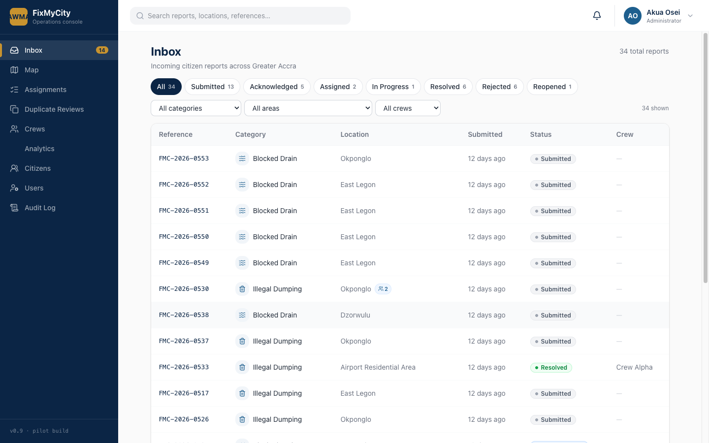

Click any row to open its detail panel.

### 2.2 Working a report

The detail panel shows the photo, location, description, follower count, assigned
crew, and the same status timeline citizens see.

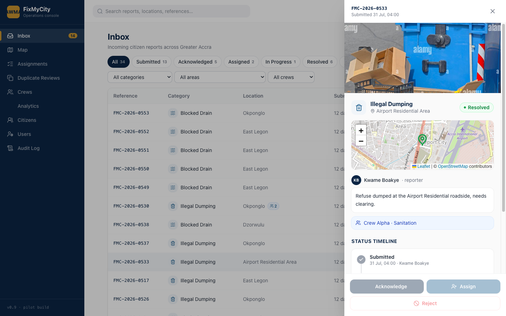

From here you can:

- **Acknowledge** — accept a Submitted (or Reopened) report as valid.
- **Assign** — route an Acknowledged (or Submitted/Reopened) report to an
  available crew. Unavailable crews don't appear in the picker.
- **Reject** — decline a report at any point before it's resolved, with a required
  reason (outside jurisdiction / duplicate / insufficient information / not valid).
- **Mark in progress / Mark resolved** — available once a crew is on the case
  (field crew can also do this themselves — see §3).

Every action fires a notification to the citizen and any followers, and is written
to the permanent audit trail — there's no way to change a status without it being
logged.

### 2.3 Duplicate Reviews

The AI service flags candidate duplicate pairs here for your judgement.

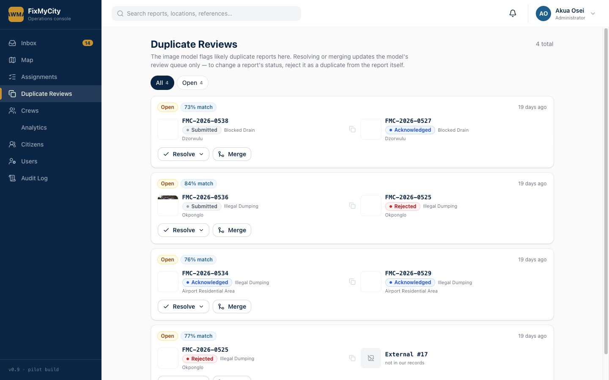

Resolve each pair (Duplicate / Possible duplicate / Supporting evidence / Reject —
not a duplicate) or Merge. **This never changes a report's own status** — if you
determine a report genuinely is a duplicate, reject it as such from the report's own
detail panel (§2.2), which is the only place status actually changes.

### 2.4 Map, Assignments, Citizens

- **Map** — the same status-coloured pin view citizens see, plus staff detail access.
- **Assignments** — one column per crew, showing their active workload.
- **Citizens** (Administrator/Supervisor only) — a read-only directory of registered
  residents.

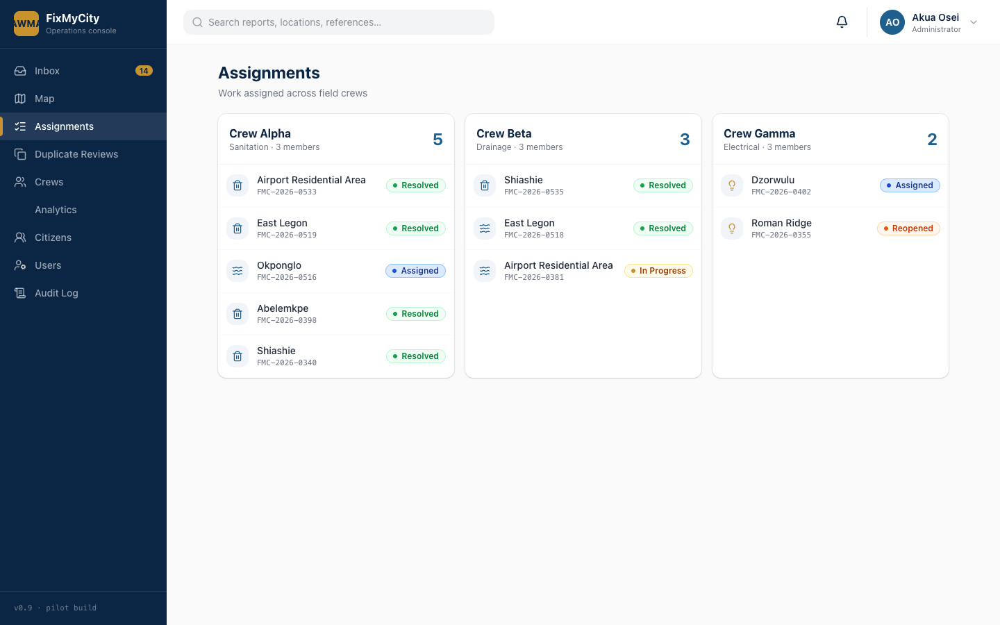
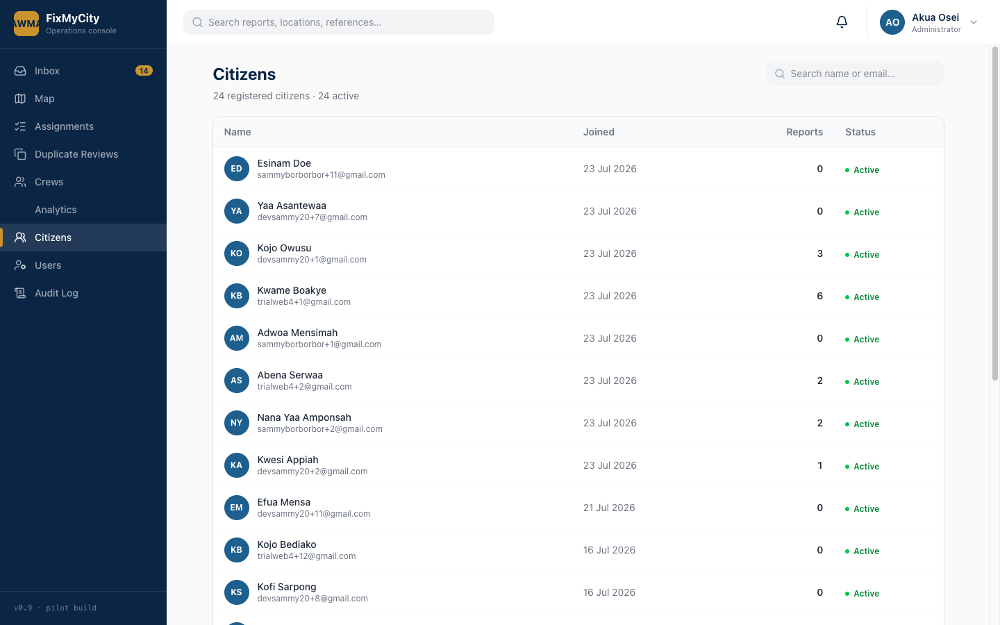

---

## 3. Field Crew Guide

Field Crew accounts sign in to the same console but see a restricted view: only
reports assigned to their own crew.

- Open your assignment queue to see what's waiting.
- Tap **Start** on an Assigned report to mark it In Progress — this notifies the
  citizen and any followers automatically.
- Once the issue is fixed, tap **Mark Resolved** and attach a resolution photo as
  evidence.

You do this directly — a Reports Officer doesn't need to relay status changes on
your behalf, which is what keeps the loop closing quickly.

---

## 4. Administrator Guide

Administrators see everything Reports Officers do, plus:

### 4.1 Users & Roles

Invite new staff accounts and assign a console role — Administrator, Supervisor,
Officer, Dispatcher, Viewer, or Field Crew. Dispatcher can only acknowledge and
assign reports; Viewer is read-only. Suspend or reactivate an account from the same
screen.

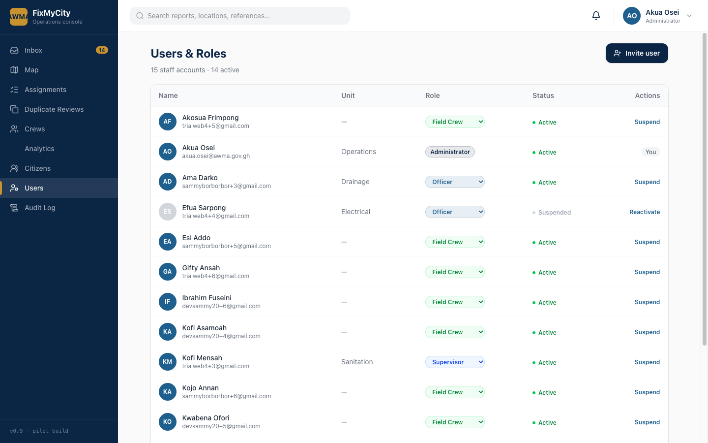

### 4.2 Crews

Create crews, add or move members between them, set a crew's lead, and toggle
availability — unavailable crews drop out of the Assign picker everywhere.

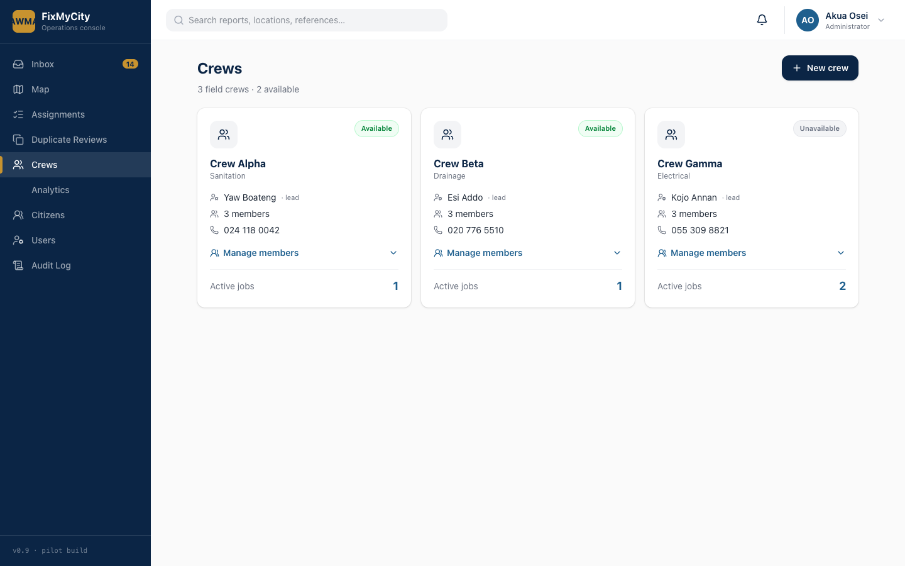

### 4.3 Analytics

Operational metrics — average resolution time and week-over-week resolved counts —
computed live from the audit trail, not hardcoded.

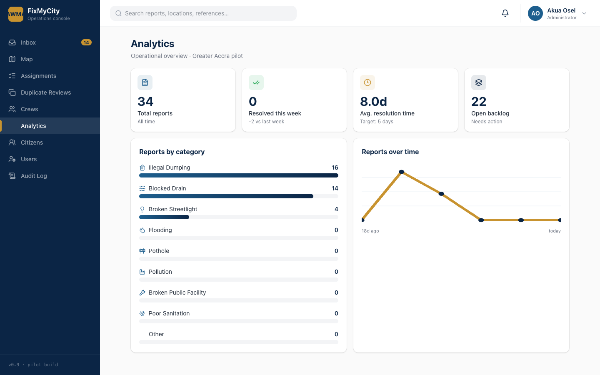

### 4.4 Audit Log

A placeholder for now (read-only, "coming in next iteration") — every status
transition is already fully logged in the database and visible per-report in each
detail panel's timeline; a consolidated cross-report audit view is tracked as future
work in `docs/MAINTENANCE_AND_EVOLUTION.md`.

---

## Troubleshooting / FAQ

**"This location is outside Ayawaso West Municipal Assembly."** — The pilot only
covers AWMA (Legon, East Legon, Dzorwulu, Abelemkpe, Airport Residential Area, Roman
Ridge, Shiashie, Okponglo). Move the map pin to a location inside the municipality.

**"Retake this photo."** — The AI service didn't recognise your photo as a genuine
environmental issue. This check doesn't apply to Broken Streetlight or Other reports.

**I can't cancel my report.** — Cancellation is only available while a report is
still Submitted (before a Reports Officer acknowledges it), so staff work isn't
undone underneath them.

**I don't see a "Reopen" button.** — Reopen only appears within 7 days of a report
being marked Resolved.

**As Dispatcher, I can't reject a report.** — This is by design — Dispatcher can only
Acknowledge and Assign; rejection requires an Officer, Supervisor, or Administrator.
