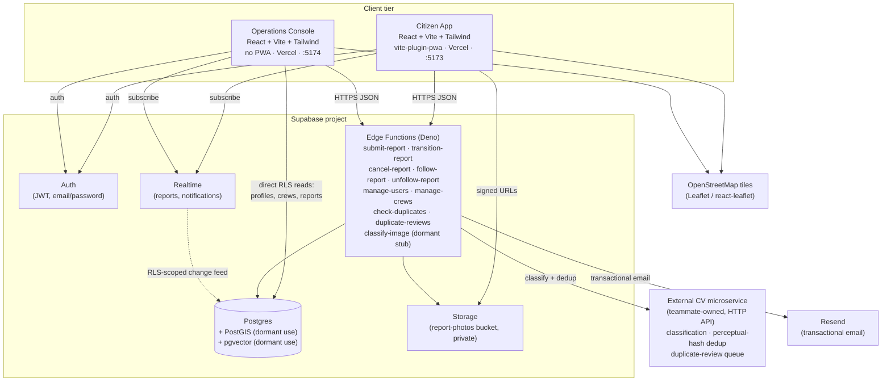
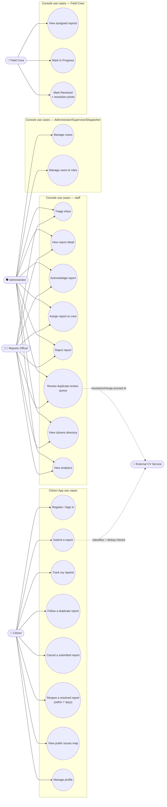
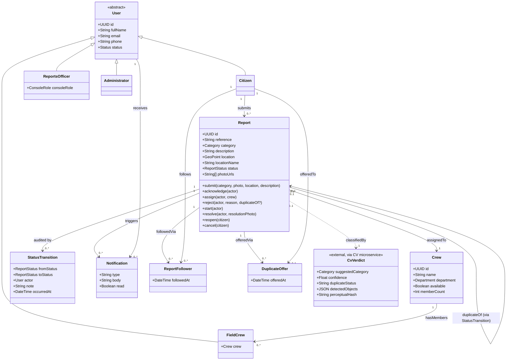
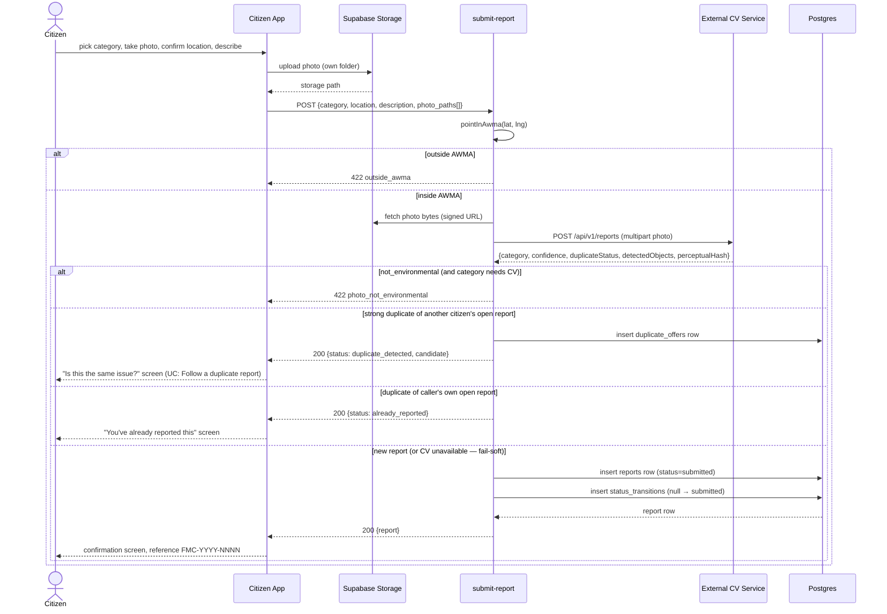
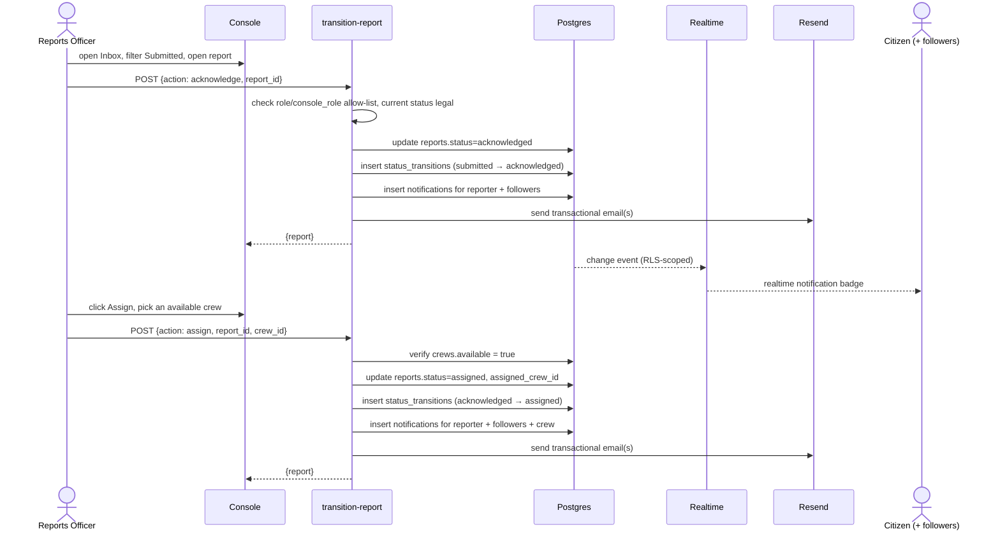
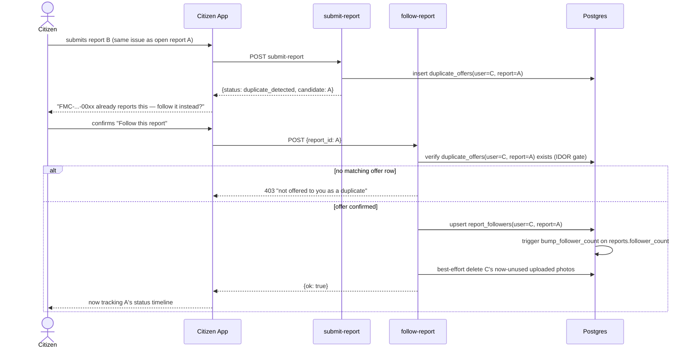
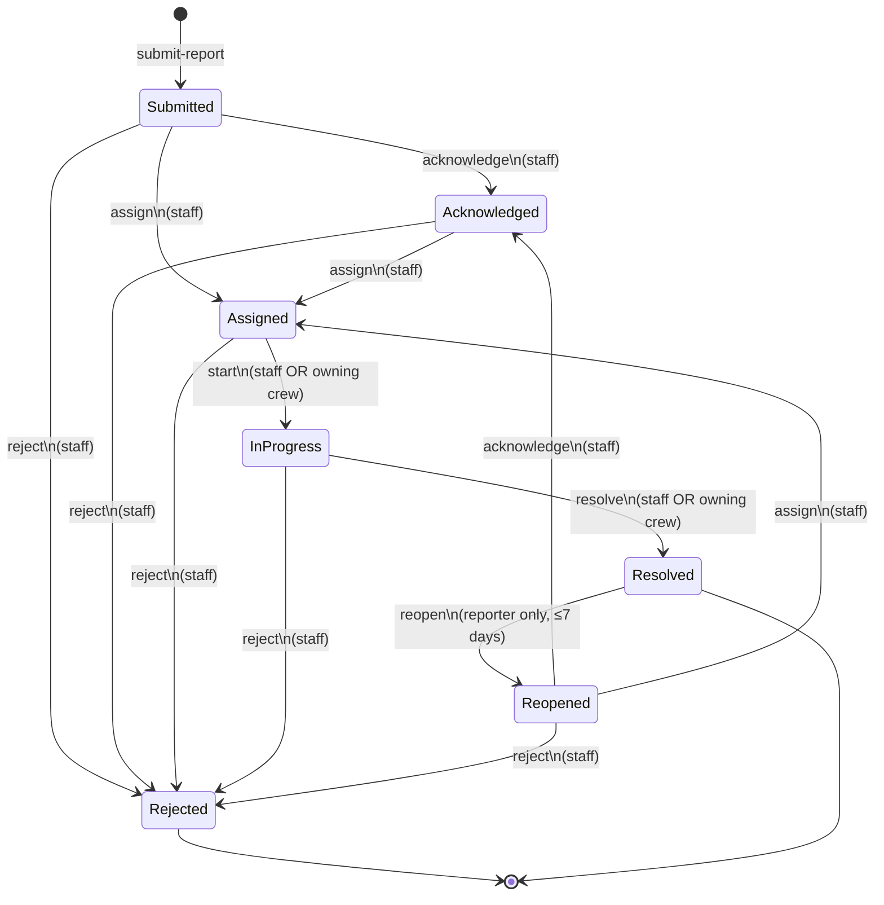
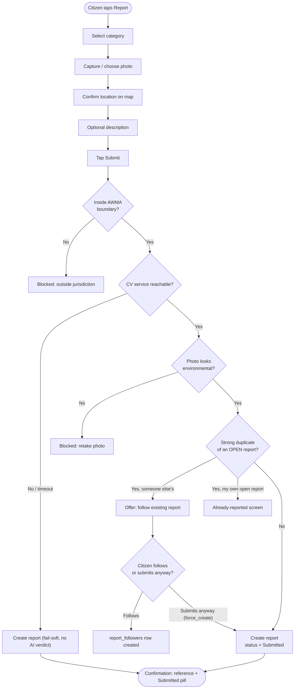
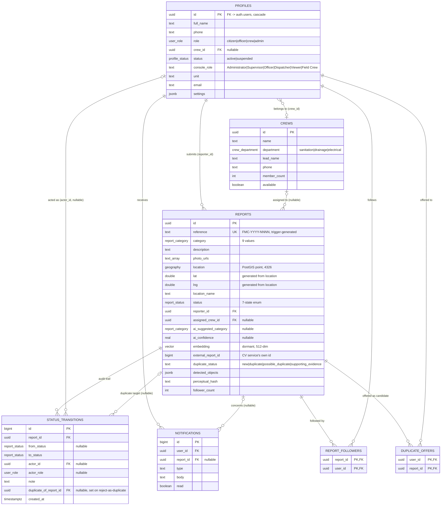
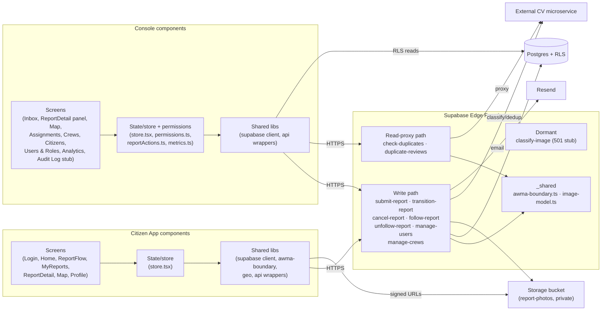

# FixMyCity — System Analysis & Design Document

CSCD 602 Capstone — Group Zero Down Time. Companion to `docs/srs/SRS.md` (the
requirements) and `CLAUDE.md` (the living project brief). See `docs/GROUP_INFO.md`
for the group/member roster.

**Provenance note:** every diagram below is derived directly from the shipped code —
`supabase/migrations/*.sql` (18 migrations) and `supabase/functions/*` (10 edge
functions) — not from prose descriptions, which can drift out of date as the system
evolves. Where CLAUDE.md's own architecture prose is now stale (most notably: image
classification and duplicate detection are handled by an external computer-vision
microservice rather than an in-house Claude-vision call or PostGIS/pgvector pipeline,
and six edge functions exist that CLAUDE.md doesn't mention), these diagrams follow
the real system.

---

## 1. System Architecture

FixMyCity is a three-tier system: two independently deployed React PWAs sharing one
Supabase backend, plus one external AI microservice the team does not own.

**Why two client apps talk to Postgres two different ways.** Citizen writes always go
through an edge function (`submit-report`, `cancel-report`, `follow-report`, …) because
every write needs server-side validation (AWMA jurisdiction gate, CV classification,
duplicate blocking) that can't be trusted to the client. Console reads for
low-stakes directory views (Citizens list, Crews list) go straight to Postgres under
RLS, because there's no business logic to enforce beyond "is this caller staff" — RLS
already answers that. Console *writes* still go through edge functions
(`manage-users`, `manage-crews`, `transition-report`) for the same reason as citizen
writes: authorization and audit-logging can't live in the client.

**Technology architecture (deployment view).** Citizen and Console are separate Vercel
projects (Citizen is live; Console is not yet deployed — see the Deployment doc).
Supabase hosts Postgres/Auth/Storage/Edge-Functions/Realtime as one managed project.
The CV microservice and Resend are external, reached over HTTPS with an API key
(`IMAGE_MODEL_URL`/`IMAGE_MODEL_API_KEY`, `RESEND_API_KEY`). No component is unique to
a single cloud provider by design (Postgres, Deno edge functions, and static React
builds are all portable).

---

## 2. Use-Case Diagram

Mermaid has no native UML use-case notation; actors are drawn as boxes on the left,
use cases as rounded/stadium nodes grouped by subsystem.

Note: `Dispatcher` (a `console_role`) may only perform `Acknowledge` and `Assign`
among the staff actions; `Viewer` may perform none — both are narrower slices of the
"Reports Officer" actor above, not separate actors, since they share the same use
cases with a reduced permission set enforced server-side in `transition-report`.

---

## 3. Class Diagram (Conceptual Domain Model)

This is a conceptual/domain model, not a 1:1 mirror of the physical schema (Section 6
covers that) — it expresses the system's behaviour in OOP terms for readability, even
though the real implementation is serverless functions over Postgres rather than a
class hierarchy.

---

## 4. Sequence Diagrams

### 4.1 Citizen submits a report (with AWMA gate, CV classification, and duplicate branch)

### 4.2 Reports Officer acknowledges and assigns a report

### 4.3 Follow-a-duplicate flow (citizen chooses not to file a second report)

**Design note on the `duplicate_offers` gate.** The `report_followers` RLS `select`
policy lets anyone in the table see the report they're following — so without a
gate, `follow-report` would let any authenticated citizen attach themselves as a
follower of *any* report ID they guess, an insecure direct object reference (IDOR).
Requiring a `duplicate_offers` row — which only `submit-report` ever writes, and only
for the specific citizen who was just shown that specific candidate — closes that
hole. This is exactly the "IDOR fix" referenced in `docs/NOTABLE_FEATURES.md`.

---

## 5. Activity / Process Diagrams

### 5.1 Report status lifecycle (state diagram — the system's architectural centre)

Every arrow above writes exactly one `status_transitions` row (timestamp + actor +
optional note) inside the same server-side transaction that updates `reports.status`
— if the audit insert fails, `transition-report` reverts the status update, so the
current status and the audit trail can never disagree. `Dispatcher` console-role staff
may only fire `acknowledge`/`assign`; `Viewer` staff may fire none of the staff
transitions — both are enforced inside `transition-report`, never on the client.

### 5.2 Submit-report process (citizen-facing activity view)

---

## 6. Entity-Relationship / Data Model

Every entity above also carries `created_at`; append-only tables
(`status_transitions`) have no `updated_at` by design — a
`before update` trigger (`block_transition_mutation`) rejects any UPDATE against
`status_transitions` outright, so the audit log is physically, not just
conventionally, immutable.

`report_followers` and `duplicate_offers` are not in CLAUDE.md's data-model section at
all; they're the tables behind the "follow instead of re-reporting a duplicate"
citizen workflow (Section 4.3 above) and are as central to the real system as
`status_transitions` is to the closed-loop workflow.

---

## 7. Database Design (Physical Notes)

- **Extensions:** `postgis` and `vector` are both enabled (`extensions` schema).
  PostGIS is used live for the AWMA point-in-polygon jurisdiction gate's underlying
  `geography(point,4326)` column and the `reports_location_gix` GiST index; pgvector's
  `vector(512)` embedding column and its HNSW index exist but are **dormant** — the
  duplicate-detection responsibility moved to the external CV service's perceptual
  hashing, and the SQL function `find_duplicate_candidates()` (PostGIS `ST_DWithin` +
  pgvector cosine distance) that would have used them is no longer called by any edge
  function. Both extensions stay installed for two reasons: the schema documents the
  team's original intended design (worth keeping visible for the capstone's design
  history), and re-enabling similarity search later requires no migration, only a
  code change.
- **Schemas:** `public` (client-facing, RLS'd) and `private` (SQL helper
  functions/triggers not exposed via the Data API — e.g. `current_user_role()`,
  `current_user_crew()`, used inside RLS policies to avoid the "RLS policy reads a
  table with an RLS policy on it" recursion problem).
- **Row-Level Security is on for every table.** Writes are edge-function-only: the
  `authenticated` role's grants were deliberately stripped down to `select` (plus
  three narrow, column-scoped `update` grants: `profiles.full_name/phone/settings`,
  `notifications.read`) in migration `20260707132647`. `anon` has no table grants at
  all. This means **the state machine cannot be bypassed by a client writing directly
  to Postgres** — the only door into a status change is `transition-report`, which is
  exactly the "state machine lives server-side" design principle in `CLAUDE.md`.
  `duplicate_offers` is the strictest table in the schema: RLS is on with **zero**
  policies, so it's invisible to every role except `service_role` (i.e., edge
  functions) — by design, since it exists purely as an internal capability token, not
  user-facing data.
- **Generated columns:** `reports.lat`/`reports.lng` are `GENERATED ALWAYS AS
  (ST_Y(location::geometry))`/`ST_X(...)` **STORED**, so client code (and the two
  React apps' map components) can read plain floats without needing a PostGIS client
  library, while `location` remains the single source of geographic truth.
- **Reference generation:** a `before insert` trigger
  (`private.set_report_reference()`) assigns `FMC-YYYY-NNNN` from a dedicated sequence
  (`report_reference_seq`, starting at 500) — the format promised to citizens in the
  SRS's confirmation-screen requirement (FR-015).
- **Realtime:** only `public.notifications` and `public.reports` are in the
  `supabase_realtime` publication; RLS applies to the realtime stream too, so a
  citizen's socket only ever receives their own notification inserts, while staff
  sockets receive all report changes (matching their broader `reports` select policy).

---

## 8. Component Diagram

---

## 9. Traceability to the SRS

Each diagram above exists to make a specific SRS section concrete:

| SRS section | Diagram(s) here |
|---|---|
| §4 System Features (FR-001–FR-093) | Use-Case Diagram (§2), Sequence Diagrams (§4) |
| §6 Use Cases (UC-01–UC-05) | Sequence Diagrams (§4) map 1:1 to UC-01–UC-04; UC-05 (Administrator) is covered by the manage-users/manage-crews write path in the Component Diagram (§8) |
| §7 Data Requirements | ER Diagram (§6), Database Design (§7) |
| §8 System Architecture Overview | System Architecture (§1), Component Diagram (§8) |
| Report state model (§7.3 of the SRS) | State Diagram (§5.1) — refined here with the real `console_role` carve-outs and crew self-service transitions the SRS's June-2026 draft didn't yet capture |

See `docs/design/UI_SCREENSHOTS.md` for the User-Interface design artefacts (real
captured screens from both running apps, per the "port, don't reinvent" principle in
`CLAUDE.md` — the UI was already fully built, so screenshots are stronger evidence
than redrawn wireframes).
