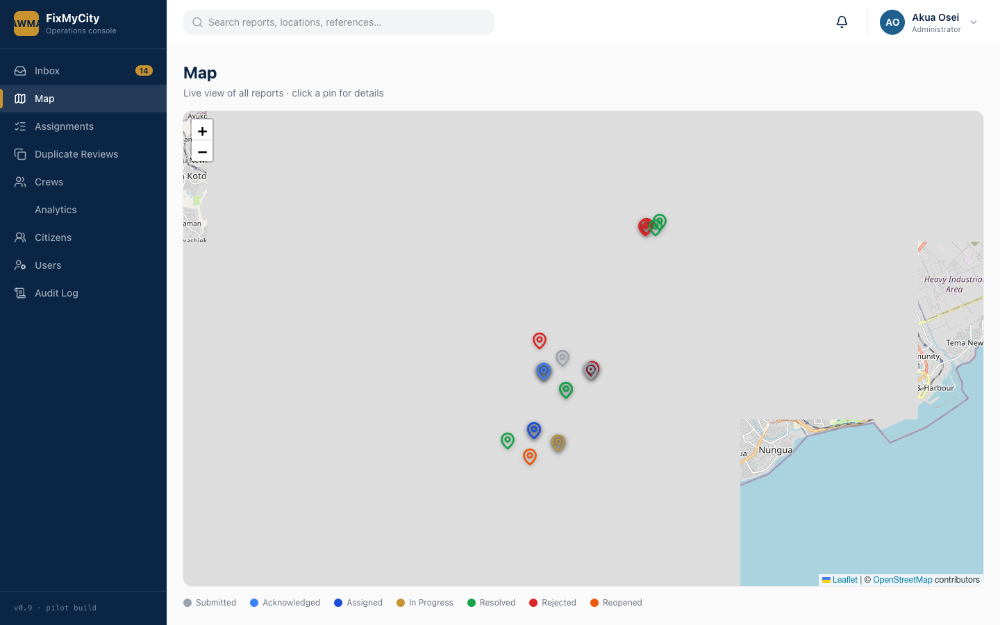

# FixMyCity — UI Screenshots

Real screenshots of the two running FixMyCity front-ends (citizen PWA + operations
console), captured against the **live hosted Supabase project** — not mockups or
redrawn wireframes. Captured with Playwright: citizen app at a 420x860 mobile
viewport, console app at a 1440x900 desktop viewport. Data shown (reports, crews,
users, timelines) is the live seeded demo dataset (`supabase/seed/demo-users.sql`).

## Citizen App

## Console

